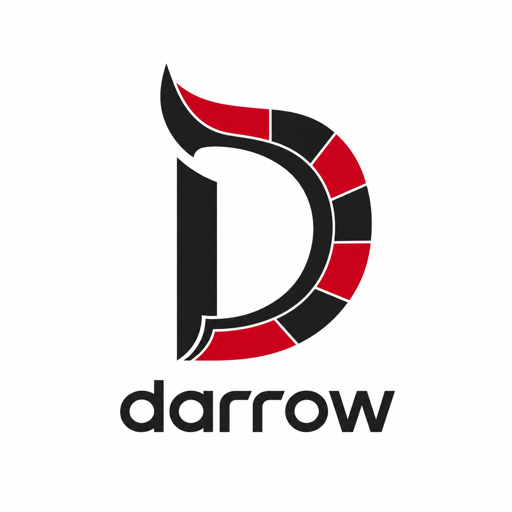

<p align="center">
  
</p>

Darrow is a marketplace of focused, independently adoptable plugins for coding
agents. Each plugin adds one bounded capability or one explicitly invoked
orchestration helper. Claude Code and Codex can use the same plugin packages
directly.

Install only the plugins you want. Installing a capability does not start work
automatically, and no plugin assumes that another Darrow plugin is present.

## Get started

1. [Install one Darrow plugin](docs/installing-plugins.md) for Claude Code or
   Codex.
2. Follow the [first-workflow tutorial](docs/getting-started.md) to run a safe,
   read-only readiness assessment.
3. Choose other plugins from the catalog below as you need them.

Most Darrow capabilities are intent-matched: ask for the outcome in ordinary
language and the agent can select the installed skill. You can also name a
skill explicitly. Orchestration is different and starts only through an
entrypoint you explicitly invoke. That entrypoint may delegate a bounded phase
to another orchestration helper while preserving your original authority.

## Plugin catalog

### Foundations

Foundation plugins maintain the durable context and reusable agent surfaces
that other work builds on. They remain intent-matched capabilities and do not
start orchestration.

| Plugin                                                                                            | Use it to                                                                    |
| ------------------------------------------------------------------------------------------------- | ---------------------------------------------------------------------------- |
| [`darrow-information-architecture`](plugins/foundation/darrow-information-architecture/README.md) | Set up or audit lean repository guidance for Claude Code and Codex.          |
| [`darrow-decisions`](plugins/foundation/darrow-decisions/README.md)                               | Capture decisions at their canonical scope and find existing records.        |
| [`darrow-skill-authoring`](plugins/foundation/darrow-skill-authoring/README.md)                   | Create, revise, and validate focused agent skills for Claude Code and Codex. |

### Capabilities

| Plugin                                                                                        | Use it to                                                                                         |
| --------------------------------------------------------------------------------------------- | ------------------------------------------------------------------------------------------------- |
| [`darrow-git`](plugins/capability/darrow-git/README.md)                                       | Create branches, commits, and pull requests through bounded Git workflows.                        |
| [`darrow-tickets`](plugins/capability/darrow-tickets/README.md)                               | Create, list, and update tracker work items through a backend-neutral interface.                  |
| [`darrow-readiness-gate`](plugins/capability/darrow-readiness-gate/README.md)                 | Check whether a request, ticket, specification, or plan is ready to implement.                    |
| [`darrow-discovery`](plugins/capability/darrow-discovery/README.md)                           | Grill ideas, discover feature behavior, and plan implementation without inventing unknowns.       |
| [`darrow-explanation`](plugins/capability/darrow-explanation/README.md)                       | Explain technical structure through compact, source-grounded visual forms.                        |
| [`darrow-tdd`](plugins/capability/darrow-tdd/README.md)                                       | Implement behavior changes and reproducible fixes through a red-to-green test slice.              |
| [`darrow-review`](plugins/capability/darrow-review/README.md)                                 | Review a pinned change for repository standards and specification fulfillment without editing it. |
| [`darrow-observability-langfuse`](plugins/capability/darrow-observability-langfuse/README.md) | Export Codex turns to Langfuse with privacy controls and work-item attribution.                   |

Each plugin README describes its skills, example requests, and safety
boundaries.

### Orchestration

[`darrow-goal-loop`](plugins/orchestration/darrow-goal-loop/README.md) is
Darrow's core orchestration helper. When explicitly invoked, it prepares
repository evidence, compiles a bounded completion contract, selects a
proportionate workflow and risk gate, and hands the work to one host-native goal
owner. It does not build a second agent runtime around that owner.

#### Deprecated reference: `darrow-ticket-pipeline`

[`darrow-ticket-pipeline`](plugins/orchestration/darrow-ticket-pipeline/README.md)
is a deprecated, still-installable reference implementation of Darrow's earlier
static phase-controller approach and executable benchmark baseline. For new
orchestration work, use `darrow-goal-loop`; deliberate installation and explicit
`deliver-ticket` invocation remain available without an additional confirmation
step.

### Task recipes

[`darrow-ticket-to-pr`](plugins/task-recipe/darrow-ticket-to-pr/README.md)
turns one explicitly invoked, ready authoritative ticket into one verified pull
request. It owns ticket-specific authority and publication safety, then
delegates execution to adaptive-goal.

## How Darrow works

Capabilities teach an agent how to perform a focused kind of work. The model
can select them from a matching request, and users can invoke them explicitly.
They remain useful without orchestration and compose through host-visible
intent and capability contracts.

Orchestration owns a different concern: framing and continuing longer-running
work until an observable completion condition is reached. It starts only
through an explicitly invoked entrypoint, which may delegate a bounded phase to
another orchestration helper. It never starts merely because a task is complex
or multi-step.

Across both layers, skills retain contextual judgment while narrow bundled
scripts own repeatable command construction, validation, parsing, and compact
result reporting. Plugin-shipped mechanics use portable Bash. The shared
TypeScript/Bun eval runner is repository development infrastructure, not a
plugin runtime dependency.

Every skill carries colocated evals for its public behavior and intent
boundaries. Behavior-changing variants are compared with relevant controls
under matched fixtures, prompts, routes, and checks before Darrow attributes an
advantage to the variant.

See [Design principles](docs/design.md) for the rationale and architectural
boundaries.

## Repository reference

- [Capability specifications](docs/specs) define normative behavior.
- [Accepted decisions](docs/decisions) record settled repository choices.
- [Research](docs/research) preserves exploratory, non-normative analysis.
- [Contributing](CONTRIBUTING.md) explains repository working agreements and
  verification.

The shared repository marketplace manifest is
[`.claude-plugin/marketplace.json`](.claude-plugin/marketplace.json). Every
plugin also includes native Claude Code and Codex manifests.

## Standing on the shoulders of giants

Darrow stands on the shoulders of excellent open-source work. I took
inspiration from [obra's Superpowers](https://github.com/obra/superpowers) and
especially [Matt Pocock's skills](https://github.com/mattpocock/skills). I also
learned a great deal from studying
[Ouroboros](https://github.com/Q00/ouroboros) and
[oh-my-codex](https://github.com/Yeachan-Heo/oh-my-codex). They are wonderful
projects—go check them out. Matt Shumer's
[Gauntlet Loop](https://somethingbig.ai/gauntlet-loop) directly prompted the
native goal-loop research: give an agent the outcome and an inspectable quality
bar, let it choose the route, use fresh critics, and keep improving against the
bar.

Dexter Horthy's
[“show-me: a coding agent skill for compact visual representations”](https://www.linkedin.com/pulse/show-me-coding-agent-skill-compact-visual-dexter-horthy-w5yac/)
and HumanLayer's open-source
[`show-me` skill](https://github.com/humanlayer/skills/blob/main/plugins/show-me/skills/show-me/SKILL.md)
directly inspired the compact, smallest-fitting-view approach in
`darrow-explanation`.

## Development

```sh
bun install
bun run hooks:install
bun run lint
bun run typecheck
bun test
bun run check:decisions
```

`bun run lint` checks all Prettier-supported tracked project content. The
pre-commit hook applies the same formatting gate to staged files.

## License

Darrow is source-available under the
[Business Source License 1.1](LICENSE), with the Mozilla Public License 2.0 as
the Change License. **Each released version becomes MPL-2.0 two years after it
is published.**

The standard BSL terms permit copying, modification, redistribution, and all
non-production use.

Additional production use that is free, without asking:

- Use Darrow within your own organization for purposes other than commercial
  education.
- Use it in client work that is not commercial education.
- Use it to teach third parties, run workshops or courses, give talks or
  presentations, and publish blog posts or articles when the activity has no
  commercial interest.
- Use it in research, evaluation, and personal projects.

Not included in the free production-use grant:

- Use Darrow in education with a commercial interest, whether the audience is
  inside or outside your organization. That includes compensation or
  sponsorship, bundling with or promoting paid offerings, lead generation, and
  other direct or indirect commercial benefits.
- Offer Darrow, or a derivative of it, to third parties as a product or service
  whose principal value is Darrow's functionality.

Under the BSL terms, production use outside the Additional Use Grant requires
you to purchase a commercial license or refrain from that use. For commercial
licensing, contact bjoern@bjro.de.

Production-use grants are version-specific. Earlier versions remain available
under the Additional Use Grant distributed with those versions.

Contributions are accepted under Apache-2.0 plus a relicensing grant; see
[CONTRIBUTING.md](CONTRIBUTING.md).
