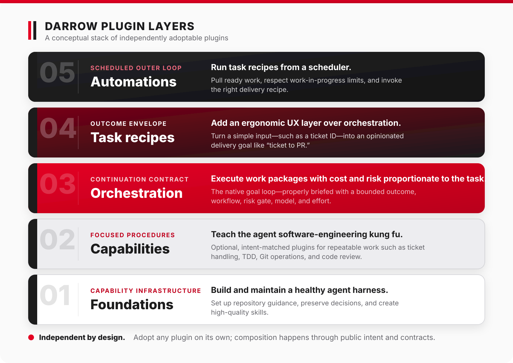

# Darrow

  

Darrow is a marketplace of focused, eval-tested plugins for Codex and Claude
Code. It is for developers who want repeatable Git, review, planning, and
implementation skills while choosing what to adopt.

Install one plugin at a time. Capabilities match your request; orchestration
starts only when explicitly invoked and uses a host-native execution owner.
Codex is the primary development host; Claude Code support is best-effort.

Darrow is actively developed; check [host requirements and verification limits](docs/installing-plugins.md#prerequisites)
before installing or updating.

## Get started

Try the [read-only readiness tutorial](docs/getting-started.md): install one
plugin, assess a small request, and inspect its verdict without editing code.
The [installation guide](docs/installing-plugins.md) covers each host, updates,
removal, verification, and recovery.

## Ask the guide

Open this checkout in a fresh session and ask “What is Darrow?” Use
`$darrow-guide` in Codex or `/darrow-guide` in Claude Code to invoke it explicitly.
It reads repository sources and explains them; it does not install or run work.

Prefer browsing? The [documentation hub](docs/README.md) works without an agent.

## The five layers

Foundations, capabilities, orchestration, task recipes, and planned automation
describe responsibilities, not a mandatory sequence.

  

[Read the diagram's equivalent text description](docs/choosing-plugins.md#understand-the-layers).

## Choose your next plugin

Use the [intent-first catalog](docs/choosing-plugins.md), then read the selected
plugin's prerequisites, examples, and safety boundaries.

[Foundations](plugins/foundation/README.md) ·
[Capabilities](plugins/capability/README.md) ·
[Orchestration](plugins/orchestration/README.md) ·
[Task recipes](plugins/task-recipe/README.md)

## Explore and contribute

[Design principles](docs/design.md) and [layer contracts](docs/specs/layer-composition.md)
explain ownership and architectural choices. For problems, start with
[troubleshooting](docs/troubleshooting.md).

[Contributing](CONTRIBUTING.md) covers development and checks. Go deeper through
[specifications](docs/specs/README.md), [accepted decisions](docs/decisions/README.md),
and [research](docs/research/README.md).

[Acknowledgements](docs/acknowledgements.md) credit the projects and people behind Darrow's ideas.

## License

Darrow is source-available under the
[Business Source License 1.1](LICENSE), with the Mozilla Public License 2.0 as
the Change License. **Each released version becomes MPL-2.0 two years after it
is published.**

**In short:** free for internal use, client work, research, personal projects,
and teaching without commercial interest. Commercial education and offering
Darrow's functionality as a product or service require a commercial license.

The standard BSL terms permit copying, modification, redistribution, and all
non-production use.

Additional production use that is free, without asking:

- Use Darrow within your own organization for purposes other than commercial
  education.
- Use it in client work that is not commercial education.
- Use it to teach third parties, run workshops or courses, give talks or
  presentations, and publish blog posts or articles when the activity has no
  commercial interest.
- Use it in research, evaluation, and personal projects.

Not included in the free production-use grant:

- Use Darrow in education with a commercial interest, whether the audience is
  inside or outside your organization. That includes compensation or
  sponsorship, bundling with or promoting paid offerings, lead generation, and
  other direct or indirect commercial benefits.
- Offer Darrow, or a derivative of it, to third parties as a product or service
  whose principal value is Darrow's functionality.

Under the BSL terms, production use outside the Additional Use Grant requires
you to purchase a commercial license or refrain from that use. For commercial
licensing, contact bjoern@bjro.de.

Production-use grants are version-specific. Earlier versions remain available
under the Additional Use Grant distributed with those versions.

Contributions are accepted under Apache-2.0 plus a relicensing grant; see
[CONTRIBUTING.md](CONTRIBUTING.md).
